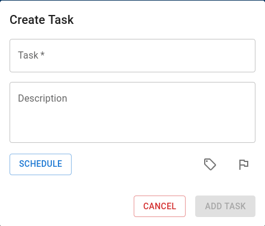
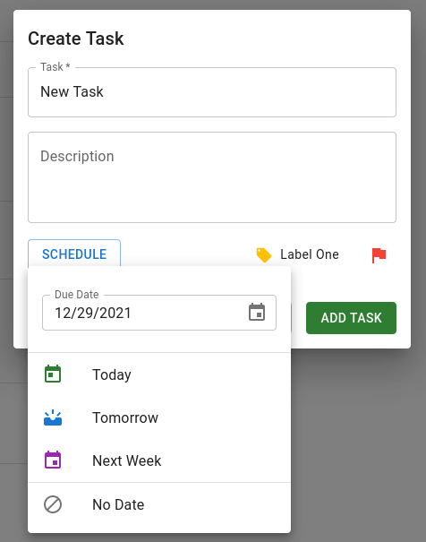
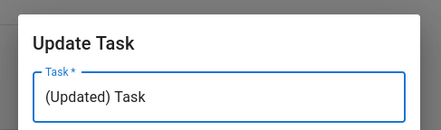
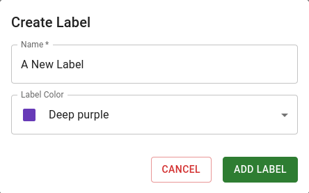

  
  <h1 align="center">TaskList</h1>
  
A lightweight, intuitive To Do List web app, built with React and Material UI.

<section>
  <h2>Preview</h2>
  
<a href="https://jonrutter-tasklist.netlify.app/">Live demo</a>

  
</section>

<section>
  <h2>Features</h2>
  <h3>Create Tasks</h3>
  
Create new tasks with ease.

  
    
  
Easily add a due date, label, and priority level to your tasks to better organize your workflow.

  
    
  
Made a mistake? Just update your task later.

  

  
  <h3>Labels</h3>
  
Tag your tasks with color-coded labels.

    

</section>
