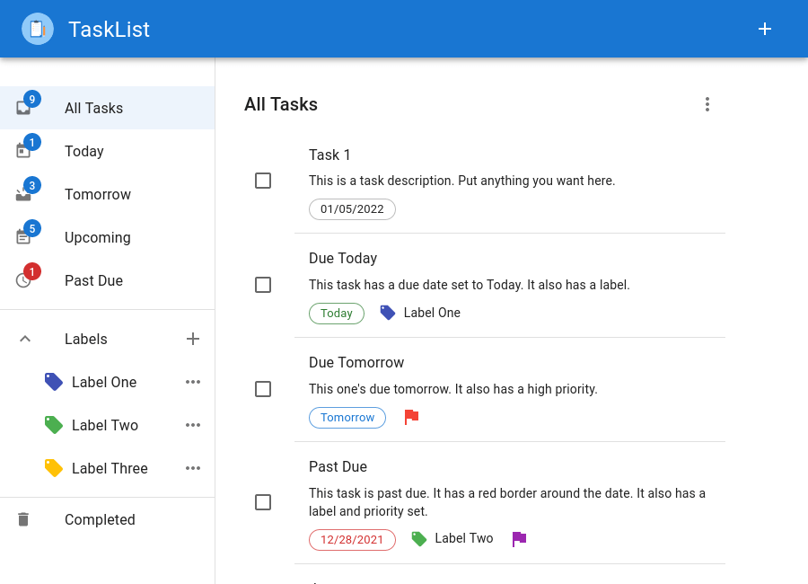

  
  <h1 align="center">TaskList</h1>

A lightweight, intuitive, open source to-do list app.

  
Table of Contents

  <ol>
    <li><a href="#description">Description</a></li>
    <li><a href="#live-demo">Live Demo</a></li>
    <li><a href="#built-with">Built With</a></li>
    <li><a href="#author">Author</a></li>
    <li><a href="#license">License</a></li>
  </ol>

## Description

Todoist is an open source to-do list web application, built with TypeScript, React, and Material UI.

Todoist supports creating, updating, and deleting tasks, which can be tagged with labels, due dates, and a priority level.

 

## Live Demo

Preview a live demo: [https://tasklist-rutterjt.netlify.app/](https://tasklist-rutterjt.netlify.app/)

## Built with

- [TypeScript](https://www.typescriptlang.org/)
- [React](https://reactjs.org/)
- [Material UI](https://mui.com/)

## Author

**Jon Rutter**

- [GitHub Profile](https://www.github.com/rutterjt)
- [Email](mailto:contact@jonrutter.io)
- [Website](https://www.jonrutter.io)

## License

This project is licensed under the MIT License. See the LICENSE file for details.
